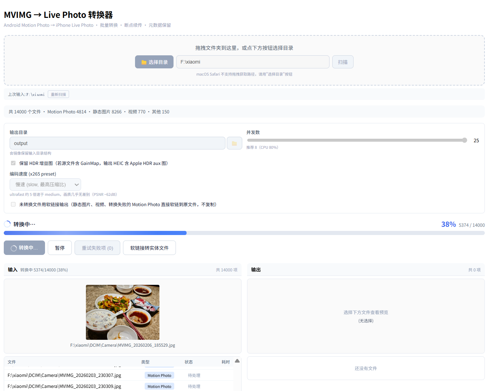
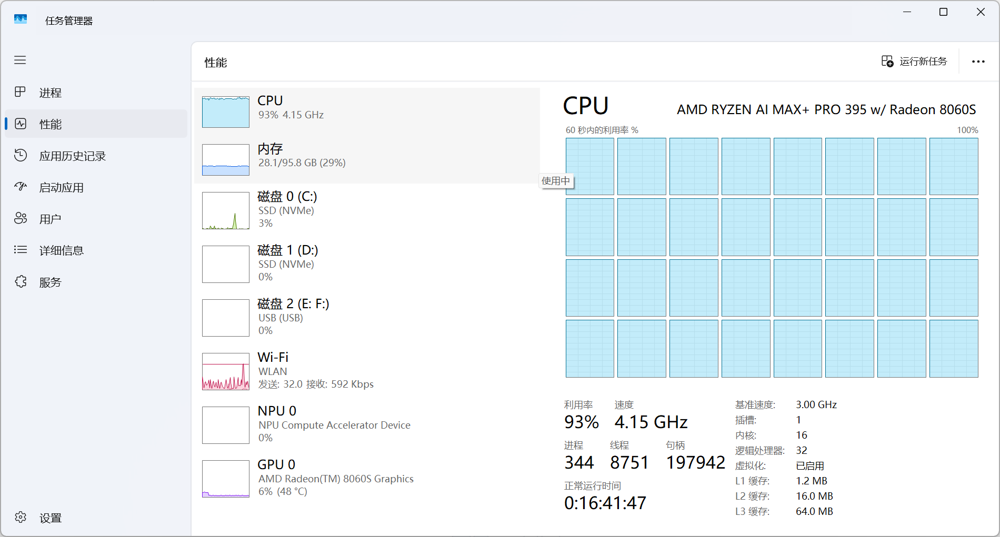

# MotionPhoto2AppleLivePhoto

把安卓/小米 Motion Photo 动态照片转换成 iPhone/iOS 可识别的 Live Photo 实况照片。

项目目标是尽量保留原图信息，包括拍摄时间、GPS、设备信息等元数据，并输出可以导入 Apple Photos 的成对文件：

- `.HEIC`：Live Photo 静态图
- `.MOV`：Live Photo 视频



## 主要功能

- 批量扫描目录，自动识别 Android Motion Photo
- 支持小米 `GCamera:MotionPhoto` 和 `GCamera:MicroVideoOffset` 等格式
- 转换为 Apple Live Photo 所需的 `HEIC + MOV`
- 保留 EXIF、拍摄时间、GPS、设备信息等元数据
- 可选保留 HDR GainMap，输出 Apple HDR auxiliary image
- Web UI 实时显示扫描、转换进度和输出结果
- 支持断点续传：已成功处理且内容未变的文件会自动跳过
- 支持普通图片、视频、未知文件复制/链接到输出目录

## 快速使用

### 1. 激活环境

Windows Git Bash 下：

```bash
source ~/miniconda3/etc/profile.d/conda.sh
conda activate vphoto
```

macOS/Linux 终端下：

```bash
source ~/miniconda3/etc/profile.d/conda.sh
conda activate vphoto
```

如果你用的是 Anaconda，把上面的 `~/miniconda3` 换成 `~/anaconda3`。

### 2. 启动 Web UI

Windows Git Bash：

```bash
cd ~/repo/MotionPhoto2AppleLivePhoto/webapp
./dev.sh
```

macOS/Linux：

```bash
cd ~/repo/MotionPhoto2AppleLivePhoto/webapp
./dev.sh
```

打开：

```text
http://127.0.0.1:5173
```

### 3. 转换流程

1. 在页面中选择或输入安卓照片目录
2. 点击扫描，确认 Motion Photo 数量
3. 设置输出目录
4. 根据需要调整并发数、编码速度、HDR 选项
5. 点击开始转换
6. 转换成功一个，输出列表会实时出现一个结果

## 命令行测试

Windows Git Bash：

```bash
source ~/miniconda3/etc/profile.d/conda.sh
conda activate vphoto
cd ~/repo/MotionPhoto2AppleLivePhoto

bash run_tests.sh
```

macOS/Linux：

```bash
source ~/miniconda3/etc/profile.d/conda.sh
conda activate vphoto
cd ~/repo/MotionPhoto2AppleLivePhoto

bash run_tests.sh
```

## 扫描 Motion Photo 覆盖率

项目提供了一个扫描脚本，用来统计某个目录里哪些文件能被识别为 Motion Photo：

```bash
python scripts/scan_motion_photo_coverage.py --root /f/xiaomi --all-files --output motion_photo_coverage.csv
```

输出 CSV 中包含路径、文件大小、分辨率、是否 Motion Photo、解析错误等信息。

## 基本原理

Android Motion Photo 通常是一个 JPEG 文件，前半部分是静态照片，尾部追加一段 MP4 视频。文件里的 XMP 元数据会描述这些内容的位置，例如：

- `GCamera:MotionPhoto`
- `GCamera:MicroVideo`
- `GCamera:MicroVideoOffset`
- `Container:Directory`
- `Item:Semantic="MotionPhoto"`

本项目会：

1. 解析 JPEG/XMP，定位静态图、GainMap 和尾部 MP4
2. 提取静态图和视频
3. 将静态图重新编码为 Apple 兼容 HEIC
4. 将 MP4 封装为 MOV
5. 为 HEIC 和 MOV 注入相同的 Apple `ContentIdentifier`
6. 保留原始 EXIF/GPS/时间等元数据
7. 输出同名 `.HEIC + .MOV`，供 Apple Photos 配对识别为 Live Photo

更详细的格式分析、兼容性结论和实验记录见 [guide.md](guide.md)。

## 性能

HEIC 编码主要走 CPU。Web UI 支持并发转换，可以根据机器负载调整 worker 数。



## 输出说明

对于 Motion Photo：

```text
input/MVIMG_20260324_220411.jpg
```

会输出：

```text
output/MVIMG_20260324_220411.HEIC
output/MVIMG_20260324_220411.MOV
```

对于非 Motion Photo 文件：

- 普通图片：复制到输出目录，保留 metadata
- 视频：优先软链接，失败时硬链接，再失败时复制
- 其它文件：复制到输出目录

## 注意事项

- Web UI 缓存文件在用户目录下的 `.mvimg2livephoto`：
  - 扫描缓存：`~/.mvimg2livephoto/scan_cache.db`
  - 转换进度：`~/.mvimg2livephoto/progress.db`
- Windows 上对应路径一般是 `C:\Users\<用户名>\.mvimg2livephoto\scan_cache.db`
- 如果修改了 Motion Photo 识别逻辑，Web UI 里旧的扫描缓存可能需要重新扫描或删除 `scan_cache.db`
- Windows 下软链接可能需要管理员权限或开发者模式；项目会自动 fallback 到硬链接/复制
- HDR GainMap 是否被 Apple Photos 识别，建议用 `exiftool` 检查 HEIC 中的 auxiliary image 信息
